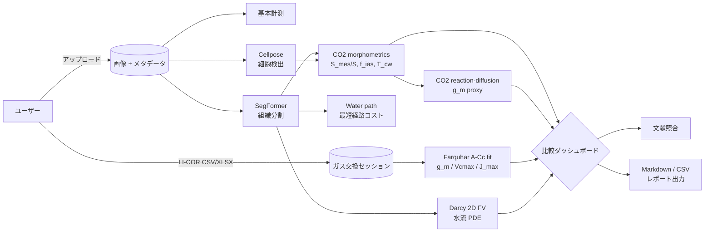

このツールキットは、**葉断面の顕微鏡画像 + LI-COR ガス交換計測** から
C3 / C4 植物の CO₂ 拡散能を定量化するための一連のパイプラインを提供します。
形態的な指標と物理シミュレーションを両輪に、

- **mesophyll conductance** $g_m$ の推定
- **葉水力コンダクタンス** $K_\text{leaf}$ の計算
- C3 / C4 グループ間の統計比較
- 文献値との自動照合とレポート出力

までを一枚の画像解析ページ + 比較ダッシュボードで完結できます。

## 全体アーキテクチャ

## データの流れ

上流の形態パイプライン（Cellpose / SegFormer）の出力を、
下流の物理パイプライン（Water path / Darcy / CO₂ 拡散）が参照する
DAG 構成になっています。中間結果はすべて `analyses` テーブルに
保存され、再実行はキャッシュされた最新結果を消さずに新しい行を
追加します。

| ステージ | 入力 | 出力 | 代表指標 |
|---|---|---|---|
| 基本計測 | 画像 + スケールバー長 | 葉厚プロファイル | `leaf_mean_thickness_um` |
| Cellpose | 画像 | 葉肉細胞ポリゴン | `cell_count`, `mean_area_px` |
| SegFormer | 画像 | 組織分割マスク | `coverage[tissue]` |
| Water path | 組織分割 | 最短経路コスト | `travel_time_mean` |
| Darcy | 組織分割 | 水流ベクトル場 | `k_leaf`, `velocity_p95` |
| CO₂ 形態 | 組織分割 + 細胞 | 2D プロキシ | `s_mes_s`, `f_ias`, `t_cw_median_um` |
| CO₂ 拡散 PDE | CO₂ 形態 | Cc, A_net | `g_m_proxy` |
| Farquhar 適合 | LI-COR セッション | g_m / Vcmax / J_max | `gm_fit.g_m` |

## 関連エンドポイント

ツールキットは FastAPI バックエンド + Next.js フロントエンド + Supabase の三層構成。
Docs ページは公開 API を直接呼び出すので、
認証状態 (`/dashboard` 配下) で閲覧してください。

> **ヒント** — 各ピペラインページ内に「理論 → 入出力スキーマ → UI 例」の順で
> 記述しています。新しいパイプラインを追加する際は `frontend/content/docs/pipelines/*.md`
> に同じ構成で追記すると、自動でサイドバーに並びます。

## このドキュメントに書けること

- **Markdown** — GFM 表、タスクリスト、脚注、打ち消し線、インラインコード
- **数式** — KaTeX ($\sin$, $\nabla \cdot \mathbf{J}$, $\displaystyle\int_\Omega$)
- **Mermaid** — flowchart / sequence / class / ER / state / gantt / pie / gitGraph / C4
- **コードブロック** — 100+ 言語のシンタックスハイライト
- **テーブル / 画像 / 動画** — `` で `<video>` 化、外部 YouTube は `<iframe>` で埋め込み
- **DOM 直書き** — `
` / `
`、注釈用の `<kbd>` / `<mark>` など

詳細な記法サンプルは [Markdown チートシート](/dashboard/docs/reference/markdown-cheatsheet) を参照。
