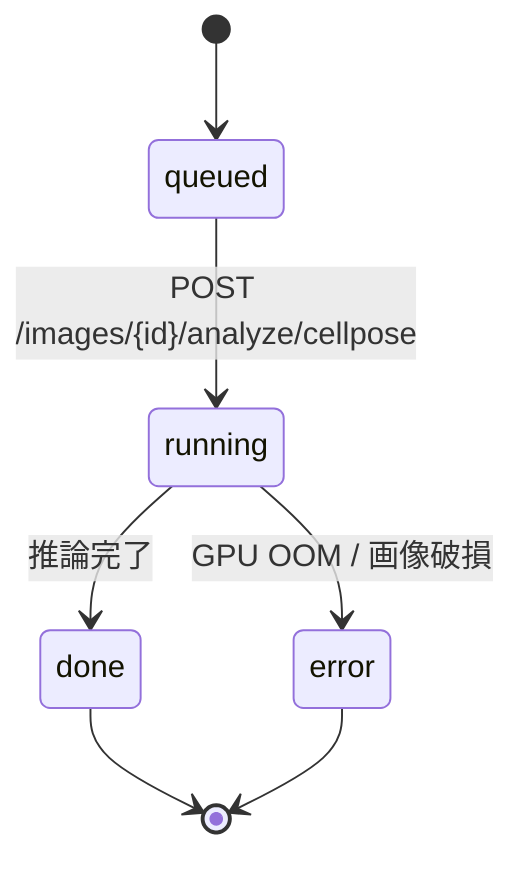

## 目的

Cellpose の事前学習モデルで、葉肉細胞を **インスタンス単位** に分割。
後段の CO₂ morphometric 計算（細胞表面積 S_mes、葉緑体被覆率など）に
必要な per-cell ポリゴンがここで出ます。

## モデル選定

| `model_name` | 用途 | 代表画像 |
|---|---|---|
| `cyto3` | 汎用、推奨デフォルト | 透過光 40× |
| `nuclei` | 核染色のみ | DAPI / Hoechst |
| `custom` | 学習済み私物 | `models/cellpose/*.pth` |

事前学習に関する背景は [^cellpose] を参照。

[^cellpose]: Pachitariu, M. & Stringer, C. (2022). *Cellpose 2.0: how to train your own model*. **Nature Methods** 19, 1634–1641.

## 処理フロー



## 数式 — インスタンス面積

Cellpose は各セル $i$ に対し 2D マスク $M_i$ を返します。
面積は単純な画素数:

$$
A_i^\text{px} = \sum_{(x,y) \in M_i} 1,
\qquad
A_i^{\mu\mathrm{m}^2} = \mu^2 \cdot A_i^\text{px}
$$

ここで $\mu$ は基本計測で得た µm/px 係数。
ヒストグラム全体の **統計量**:

$$
\bar A_\text{cell} = \frac{1}{N}\sum_{i=1}^{N} A_i^\text{px},\qquad
A_\text{cell}^{0.5} = \operatorname{median}(\{A_i^\text{px}\})
$$

## API

```http
POST /images/{image_id}/analyze/cellpose
Authorization: Bearer <supabase-jwt>
Content-Type: application/json

{
  "max_side_px": 1024,
  "diameter": null,             // null で auto-detect
  "model_name": "cyto3"
}
```

**注意**: `flow_threshold` / `cellprob_threshold` は実装に存在しない。
モデルしきい値の調整は将来追加予定。

## レスポンス

```jsonc
{
  "kind": "cellpose_cells",
  "result": {
    "cell_count": 812,
    "image_shape": [1024, 1536],   // [height_px, width_px]
    "downsample_factor": 1.0,
    "model_name": "cyto3",
    "mean_area_px": 342.1,
    "median_area_px": 318.0,
    "cells": [
      {
        "polygon":  [[x, y], [x, y], ...],
        "centroid": [x, y],
        "area_px":  318
      }
      // ...
    ]
  }
}
```

`Cell` (`pipeline/cellpose_infer.py::Cell`) は

| フィールド | 意味 |
|---|---|
| `polygon` | OpenCV `approxPolyDP` で簡略化した輪郭（元解像度座標） |
| `centroid` | モーメントから求めた重心 (px) |
| `area_px` | マスクピクセル数 (元解像度) |

を持ちます。`id` / 連番フィールドはありません — リスト内のインデックス
で識別。

## 実装上のコツ

> **GPU メモリ** — `diameter` を小さくしすぎると推論時間が爆発し、
> 逆に大きすぎると細胞が融合します。透過光 40× で **25–35 px** が目安。
> `null` を渡すと Cellpose の auto-diameter が走ります（やや遅いが安全）。

> **葉脈領域の false positive** — Cellpose は丸みを持つ塊を片端から
> 貪欲に拾うため、葉脈周囲のアーティファクトがセルとして誤検出される
> ことがあります。後段で `segformer_tissue` の `palisade ∪ spongy`
> mesophyll マスクと AND を取ると安定。`co2_morphometrics` は
> このフィルタを内部で行います。

## UI

画像詳細ページの <kbd>細胞検出</kbd> パネルからワンクリックで実行できます。


