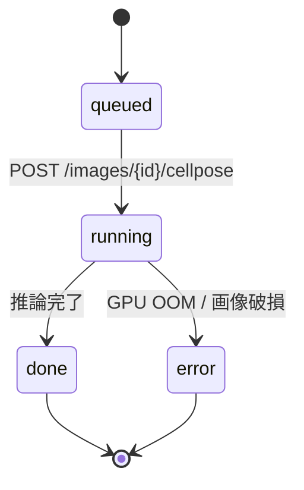

## 目的

Cellpose の事前学習モデルで、葉肉細胞を **インスタンス単位** に分割します。
後段の CO₂ morphometric 計算（細胞表面積 S_mes、葉緑体被覆率など）に必要な
セル単位のポリゴンがここで出ます。

## モデル選定

| モデル | 用途 | 代表画像 |
|---|---|---|
| `cyto3` | 汎用、推奨デフォルト | 透過光 40× |
| `nuclei` | 核染色のみ | DAPI / Hoechst |
| `custom` | 学習済みの私物 | `models/cellpose/*.pth` |

事前学習に関する背景は [^cellpose] を参照。

[^cellpose]: Pachitariu, M. & Stringer, C. (2022). *Cellpose 2.0: how to train your own model*. **Nature Methods** 19, 1634–1641.

## 処理フロー



## 数式 — インスタンス面積

Cellpose は各セル $i$ に対し 2D マスク $M_i$ を返します。
面積は単純な画素数、そして µm² への換算は

$$
A_i^\text{px} = \sum_{(x,y) \in M_i} 1,
\qquad
A_i^{\mu\mathrm{m}^2} = \mu^2 \cdot A_i^\text{px}
$$

ここで $\mu$ は基本計測で得た µm/px 係数です。
ヒストグラム全体の **統計量** は

$$
\bar A_\text{cell} = \frac{1}{N}\sum_{i=1}^{N} A_i^\text{px},\qquad
A_\text{cell}^{95} = Q_{0.95}\bigl(\{A_i^\text{px}\}\bigr).
$$

## 入出力スキーマ

```http
POST /images/{image_id}/cellpose
Authorization: Bearer <supabase-jwt>
Content-Type: application/json

{
  "model": "cyto3",
  "diameter": 30,
  "flow_threshold": 0.4,
  "cellprob_threshold": 0.0
}
```

```jsonc
{
  "kind": "cellpose_cells",
  "result": {
    "cell_count": 812,
    "mean_area_px": 342.1,
    "image_shape": [1024, 1536],
    "cells": [
      { "id": 1, "polygon": [[x,y], ...], "area_px": 318 },
      /* ... */
    ]
  }
}
```

## 実装上のコツ

> **GPU メモリ** — `diameter` を小さくしすぎると推論時間が爆発し、
> 逆に大きすぎると細胞が融合します。透過光 40× で **25–35 px** が目安。

> **葉脈領域の false positive** — Cellpose は丸みを持つ塊を
> 片端から貪欲に拾うため、葉脈周囲のアーティファクトがセルとして
> 誤検出されることがあります。後段で `segformer_tissue` の
> `mesophyll` マスクと AND を取ると安定します。

## UI 例

画像詳細ページの <kbd>細胞検出</kbd> パネルからワンクリックで実行できます。


