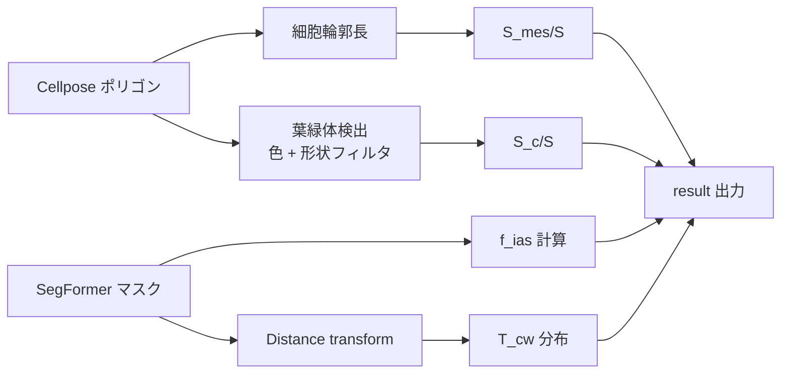

## 定義

Evans & von Caemmerer / Tosens *et al.* に倣い、以下の 4 指標を
**2D 断面プロキシ** として計算します。3D 補正係数 (~1.1–1.3) を
かければ Tosens 2012 の in-vivo 値と直接比較可能です。

| 記号 | 意味 | 単位 |
|---|---|---|
| $S_\text{mes}/S$ | 葉肉細胞露出面 / 葉面積 | 無次元 |
| $S_c/S$ | 葉緑体露出面 / 葉面積 | 無次元 |
| $f_\text{ias}$ | 細胞間隙率 (intercellular air space) | 無次元 |
| $T_\text{cw}$ | 細胞壁厚プロキシ | µm |

## 計算式

葉面積（投影）を $S_\text{leaf}$、Cellpose で得た葉肉細胞の境界長さの和を
$\ell_\text{mes}$ とすると、

$$
\frac{S_\text{mes}}{S} \;=\; \frac{\ell_\text{mes}}{S_\text{leaf}^{1/2}}
\cdot \mu
$$

葉緑体も同様、Cellpose で取った葉緑体輪郭の総延長 $\ell_c$ から

$$
\frac{S_c}{S} \;=\; \frac{\ell_c}{S_\text{leaf}^{1/2}}\,\mu
$$

細胞間隙率は SegFormer の `air_space` 面積を葉肉面積で割った値

$$
f_\text{ias} \;=\; \frac{\text{coverage}[\texttt{air\_space}]}
{\text{coverage}[\texttt{mesophyll}] + \text{coverage}[\texttt{air\_space}]}
$$

$T_\text{cw}$ は、細胞輪郭と air space 境界との **距離変換** を取り、
内側 1 px 深さの分布を µm へ換算した中央値 / 95%tile を使います。

$$
T_\text{cw}^{(i)} \;=\; \text{DT}_\text{outside}(\partial \text{cell}_i)\bigl|_{1\text{px inside}}\!,\quad
T_\text{cw}^{\text{median}} = \operatorname{median}\{T_\text{cw}^{(i)}\},\quad
T_\text{cw}^{95} = Q_{0.95}.
$$

## 処理フロー



## 出力

```jsonc
{
  "kind": "co2_morphometrics",
  "result": {
    "s_mes_s": 14.8,
    "s_c_s":    9.2,
    "f_ias":    0.28,
    "cell_wall": {
      "t_cw_median_um": 0.22,
      "t_cw_p95_um":    0.48
    },
    "chloroplasts": {
      "count": 1284,
      "coverage_of_mesophyll_cells": 0.172
    },
    "mesophyll": {
      "thickness_median_um": 168.0,
      "thickness_p5_um":      120.0,
      "thickness_p95_um":     220.0
    }
  }
}
```

## C3 / C4 で期待される差

| 指標 | C3 レンジ | C4 レンジ | 背景 |
|---|---|---|---|
| $S_\text{mes}/S$ | 8 – 22 | 3 – 8 | C4 は bundle-sheath 主体で葉肉薄い |
| $f_\text{ias}$ | 0.15 – 0.45 | 0.05 – 0.20 | C4 mesophyll が密 |
| $T_\text{cw}$ | 0.1 – 0.5 µm | 0.15 – 0.6 µm | C4 壁は厚め |

:::note
$S_\text{mes}/S$ は 3D 真値 (Tosens 2012) で `×1.2` 前後の補正係数が
かかることを念頭に置いてください。本ツールの値は 2D プロキシなので、
**グループ間の相対比較** に使うのが安全です。
:::
