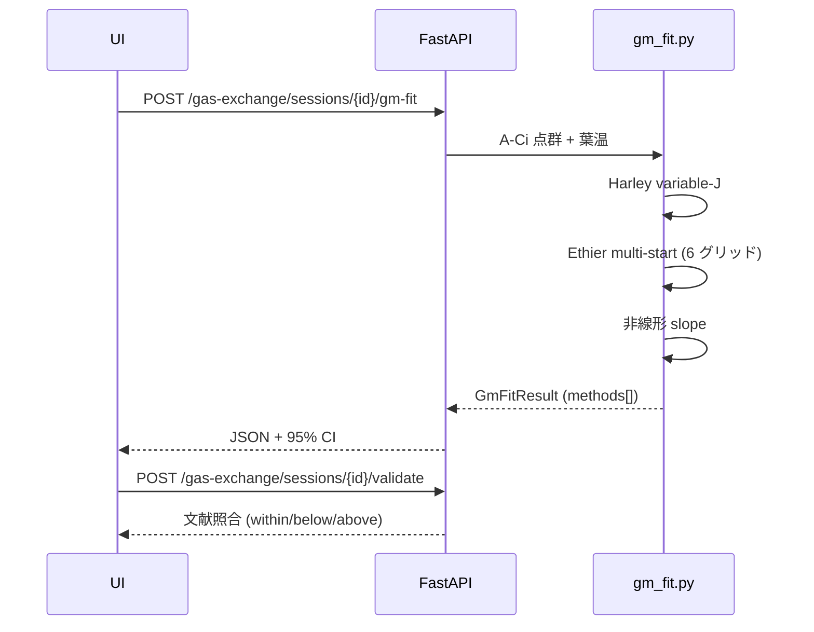

## Farquhar-von Caemmerer-Berry モデル

ネット同化速度 $A_\text{net}$ を、Rubisco 制約 $A_c$ と RuBP 再生
（電子伝達）制約 $A_j$ の **小さい方** で近似:

$$
A_\text{net} \;=\; \min(A_c,\, A_j) - R_d
$$

$$
A_c(C_c) \;=\; V_\text{cmax}\,\frac{C_c - \Gamma^*}{C_c + K_c(1 + O/K_o)},
\qquad
A_j(C_c) \;=\; \frac{J\,(C_c - \Gamma^*)}{4\,C_c + 8\,\Gamma^*}
$$

実装上 $A_j$ は代数的に等価な形 `J·(Cc-Γ*) / (4·Cc + 8·Γ*)`
(`pipeline/farquhar.py:140-143`) で書かれています。

電子伝達 $J$ は入射 PPFD $I$ に対する非直角双曲線:

$$
\theta J^2 - (\alpha I + J_\text{max}) J + \alpha I J_\text{max} = 0
$$

## Bernacchi 2001 Arrhenius 温度補正

$K_c$, $K_o$, $\Gamma^*$, $V_\text{cmax}$, $J_\text{max}$, $R_d$ は
葉温 $T_\text{leaf}$ (K) で補正:

$$
k(T) \;=\; k_{25} \cdot \exp\!\left(
  \frac{E_a}{R}\,\frac{T - 298.15}{298.15\,T}
\right)
$$

> **実装範囲の注意** — `pipeline/farquhar.py` のコメントによれば
> 現状は **simple Arrhenius のみ** 実装、deactivation 項を持つ
> peaked Arrhenius は未実装です。葉温が 25 °C から大きく外れる
> （> 35 °C）データに当てる場合は要追加実装。

## Cc の計算

葉肉抵抗 $1/g_m$ による濃度低下を引いて

$$
C_c \;=\; C_i - \frac{A_\text{net}}{g_m}
$$

ここで $C_i$ と $A_\text{net}$ は LI-COR の実測値、
$g_m$ が **推定したい未知量**。

## 3 手法を同時に走らせる

| 手法 (`method`) | 入力 | 推定値 |
|---|---|---|
| `harley_variable_j` | Aj-regime ($C_i > 300$ µmol/mol) のみ | $g_m$ 各点 |
| `ethier_livingston` | A-Ci 全点 | $V_\text{cmax}, g_m$ (非線形回帰) |
| `nonlinear_slope` | 共通 | $g_m$ ($\partial A/\partial C_i$ から) |

それぞれの手法について **bootstrap 95% CI** を算出
（既定 500 反復、`bootstrap_iters` で上書き可能、上限 5000）。



## Ethier 多点スタート

単一スタートは $g_m$ 上限で止まる縮退解に嵌ることがあるため、
$V_\text{cmax}$ × $g_m$ の **6 点グリッドから最小 RMSE を選ぶ**
（PR #16 round-1 修正）。グリッドはハードコード:

```python
init_grid = [
    (40.0,  0.05),
    (60.0,  0.2),
    (80.0,  0.5),
    (120.0, 1.0),
    (200.0, 0.1),
    (150.0, 0.3),
]
```

最適化は `scipy.optimize.least_squares` の Trust-Region-Reflective
(`method="trf"`)、bound `[1.0, 1e-4]` 〜 `[500.0, 10.0]`、`max_nfev=600`。
上下限近傍に張り付いた解 (`g_m == 1e-4` or `g_m == 10.0`) は棄却し、
残った候補で RMSE 最小のパラメータセットを採択
(`pipeline/gm_fit.py:380-417`)。

## API

```http
POST /gas-exchange/sessions/{session_id}/gm-fit
Authorization: Bearer <supabase-jwt>
Content-Type: application/json

{
  "tleaf_c": 25.0,
  "o2_mmol_mol": 210.0,            // 空気中 O2 比 (210 mmol/mol = 21%)
  "rd_default": 1.5,               // 既定 dark respiration
  "bootstrap_iters": 500           // 既定 500、最大 5000
}
```

エンドポイント名は **ハイフン区切り `gm-fit`** (`/gm_fit` ではない)。

## レスポンス

```jsonc
{
  "kind": "gm_fit",
  "result": {
    "tleaf_c": 25.0,
    "o2_mmol_mol": 210.0,
    "input_point_count": 12,
    "methods": [
      {
        "method": "harley_variable_j",
        "g_m": 0.26,                 // mol m^-2 s^-1 / (umol/mol)
        "g_m_ci_low": 0.21,
        "g_m_ci_high": 0.31,
        "vcmax": null,               // Harley は g_m / J_max のみ
        "j_max": 198.4,              // umol m^-2 s^-1
        "rd": 1.3,
        "rmse": null,
        "n_points_used": 7,
        "notes": []
      },
      {
        "method": "ethier_livingston",
        "g_m": 0.29,
        "g_m_ci_low": 0.24,
        "g_m_ci_high": 0.34,
        "vcmax": 84.1,
        "j_max": null,
        "rd": 1.5,
        "rmse": 0.42,
        "n_points_used": 12,
        "notes": []
      },
      {
        "method": "nonlinear_slope",
        "g_m": 0.27,
        "g_m_ci_low": 0.22,
        "g_m_ci_high": 0.32,
        "vcmax": null,
        "j_max": null,
        "rd": 1.5,
        "rmse": null,
        "n_points_used": 12,
        "notes": []
      }
    ],
    "notes": []
  }
}
```

> **`summary.g_m_median` / `g_m_mad` フィールドは存在しない**。
> 統合値が必要なら client 側で 3 method の median を取ってください。
> 各 `methods[]` 要素のフィールドは厳密に
> `method / g_m / g_m_ci_low / g_m_ci_high / vcmax / j_max / rd / rmse / n_points_used / notes`。

## 文献値

| 種別 | $g_m$ (mol m⁻² s⁻¹ / (µmol/mol)) | 出典 |
|---|---|---|
| C3 平均 | 0.05 – 0.60（typical 0.25） | Flexas *et al.* 2008 |
| C4 平均 | 0.03 – 0.40（typical 0.15） | Flexas *et al.* 2008 |

## 関連リンク

- ガス交換パネルと結果の見方 → [/dashboard/gas-exchange](/dashboard/gas-exchange)
- 実装: `backend/app/pipeline/gm_fit.py`
- 文献照合: `POST /gas-exchange/sessions/{id}/validate` で各 method の
  $g_m$ / $V_\text{cmax}$ / $J_\text{max}$ を `gm_fit.<key>` パラメータ
  として個別判定。
