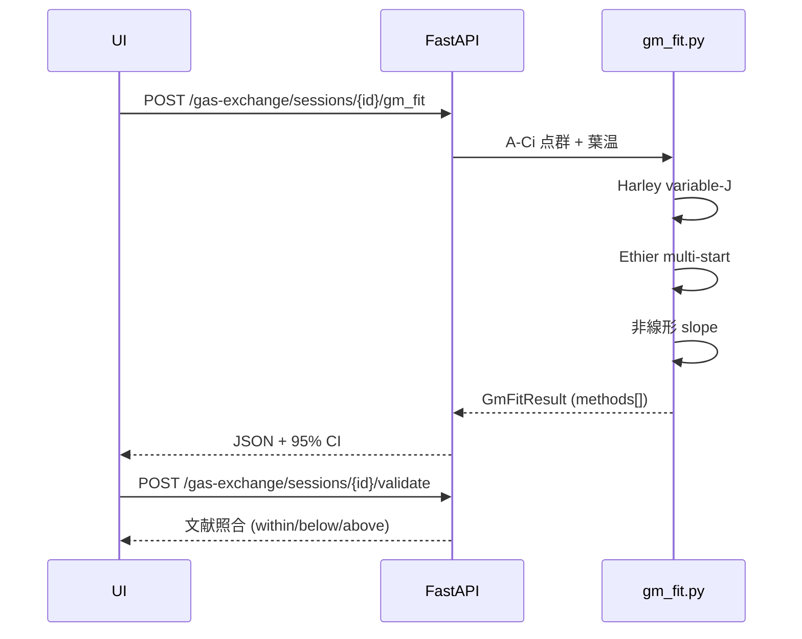

## Farquhar-von Caemmerer-Berry モデル

ネット同化速度 $A_\text{net}$ を、Rubisco 制約 $A_c$ と RuBP 再生（電子伝達）制約
$A_j$ の **小さい方** で近似します。

$$
A_\text{net} \;=\; \min(A_c,\, A_j) - R_d
$$

$$
A_c(C_c) \;=\; V_\text{cmax}\,\frac{C_c - \Gamma^*}{C_c + K_c(1 + O/K_o)},
\qquad
A_j(C_c) \;=\; \frac{J}{4}\,\frac{C_c - \Gamma^*}{C_c + 2\Gamma^*}
$$

電子伝達 $J$ は入射 PPFD $I$ に対する非直角双曲線

$$
\theta J^2 - (\alpha I + J_\text{max}) J + \alpha I J_\text{max} = 0
$$

## Bernacchi 2001 Arrhenius 温度補正

$K_c$, $K_o$, $\Gamma^*$, $V_\text{cmax}$, $J_\text{max}$, $R_d$ は葉温 $T_\text{leaf}$ (K) で補正。

$$
k(T) \;=\; k_{25} \cdot \exp\!\left(
  \frac{E_a}{R}\,\frac{T - 298.15}{298.15\,T}
\right)
$$

$J_\text{max}$ と $V_\text{cmax}$ は高温で熱失活項も入れた **peaked Arrhenius**。

$$
k(T) \;=\; k_{25}\,
\exp\!\left(\frac{E_a(T-298.15)}{298.15\,R\,T}\right)
\cdot
\frac{1 + \exp\!\bigl(\frac{298.15\,\Delta S - H_d}{298.15\,R}\bigr)}
     {1 + \exp\!\bigl(\frac{T\,\Delta S - H_d}{R\,T}\bigr)}
$$

## Cc の計算

葉肉抵抗 $1/g_m$ による濃度低下を引いて

$$
C_c \;=\; C_i - \frac{A_\text{net}}{g_m}
$$

ここで $C_i$ と $A_\text{net}$ は LI-COR の実測値、
$g_m$ が **推定したい未知量**。

## 3 手法を同時に走らせる

|  手法 | 入力 | 推定値 |
|---|---|---|
| **Harley variable-J** | Aj-regime ($C_i > 300$ µmol/mol) のみ | $g_m$ 毎点 |
| **Ethier-Livingston** | A-Ci 全点 | $V_\text{cmax}, g_m$（非線形回帰） |
| **非線形 slope** | 共通 | $g_m$（$\partial A/\partial C_i$ から） |

それぞれの手法について 95% CI を bootstrap で算出。
**3 手法の中央値 ± MAD** を統合値として報告します。



## Ethier 多点スタート

単一スタートは $g_m$ 上限で止まる縮退解に嵌ることがあるため、
$V_\text{cmax}$ × $g_m$ の 6 点グリッドから最小 RMSE を選びます
（PR #16 round-1 修正）。

```python
STARTS = [
    (vcmax0 * 0.5, gm0 * 0.5),
    (vcmax0 * 0.5, gm0 * 2.0),
    (vcmax0,       gm0),
    (vcmax0 * 1.5, gm0 * 0.5),
    (vcmax0 * 1.5, gm0 * 2.0),
    (vcmax0 * 2.0, gm0),
]
```

上限に張り付いた解（`g_m == g_m_upper`）は棄却し、
残った候補の中で RMSE 最小のパラメータセットを採択します。

## 出力

```jsonc
{
  "kind": "gm_fit",
  "result": {
    "methods": [
      { "method": "harley_variable_j", "g_m": 0.26, "rd": 1.3, "j_max": 198.4,
        "ci_low": 0.21, "ci_high": 0.31, "n_points": 7 },
      { "method": "ethier_livingston",  "g_m": 0.29, "vcmax": 84.1, "rd": 1.1,
        "rmse": 0.42, "ci_low": 0.24, "ci_high": 0.34 },
      { "method": "nonlinear_slope",    "g_m": 0.27, "ci_low": 0.22, "ci_high": 0.32 }
    ],
    "summary": { "g_m_median": 0.27, "g_m_mad": 0.015 }
  }
}
```

## 文献値

| 種別 | $g_m$ (mol m⁻² s⁻¹ / (µmol/mol)) | 出典 |
|---|---|---|
| C3 平均 | 0.05 – 0.60（typical 0.25） | Flexas *et al.* 2008 |
| C4 平均 | 0.03 – 0.40（typical 0.15） | Flexas *et al.* 2008 |

## 関連リンク

- ガス交換パネルと結果の見方 → [/dashboard/gas-exchange](/dashboard/gas-exchange)
- 実装: `backend/app/pipeline/gm_fit.py`
