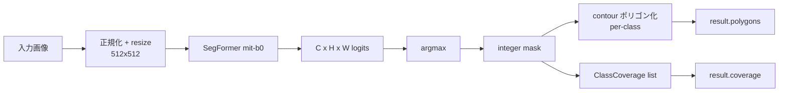

## 目的

Transformer-based セマンティック分割モデル (SegFormer) で、
葉断面画像を **11 組織クラス** に塗り分けます。後段の
すべての物理パイプライン（water_path / Darcy / CO₂ morphometrics /
CO₂ diffusion）はここで得たマスクを参照します。

## 組織クラス一覧

実装上のクラスキー (`backend/app/pipeline/classes.py::TISSUE_CLASSES`):

| クラスキー | 日本語 | 物理的役割 / 後段での用途 |
|---|---|---|
| `upper_epidermis` | 上側表皮 | 水蒸気・CO₂ バリア |
| `lower_epidermis` | 下側表皮 | 同上 |
| `palisade` | 柵状葉肉 | mesophyll の上層、Rubisco 主体 |
| `spongy` | 海綿状葉肉 | mesophyll の下層、IAS 多い |
| `bundle_sheath` | 維管束鞘 | C4 では CCM 濃縮室 |
| `xylem` | 木部 | Darcy の water source（vessel が無い場合の fallback） |
| `xylem_vessel` | 導管 | Darcy の優先 source（最高透過の管要素） |
| `phloem` | 篩部 | 糖を運ぶ。water_path / Darcy で高抵抗扱い |
| `stomata` | 気孔 | water_path の sink、CO₂ diffusion の Dirichlet 入口 |
| `intercellular` | 細胞間隙 | f_ias の分子、CO₂ の高速気相経路 |
| `other` | その他 | 未分類 |

> **注意** — ドキュメントや論文で "mesophyll" / "vein" / "air_space" /
> "stoma (単数形)" と総称することが多いですが、本実装では解剖学的に
> より細かい分類を採用しています。"mesophyll" を呼び出したい場合は
> **palisade ∪ spongy** の合成マスクを使ってください
> (`pipeline/morphometrics_co2.py` がそうしている)。同様に
> "vein" は **xylem ∪ xylem_vessel ∪ phloem ∪ bundle_sheath**、
> "air_space" は `intercellular`、"stoma (単数)" は `stomata` です。

## モデル

Finetune 済み `nvidia/mit-b0` ベース。`models/segformer/*.bin` が
無い環境では `/analyze/segformer/status` が `{ "available": false }` を返すので、
UI が自動的にパネルを無効化します。

## データフロー



## 数式 — ピクセル分類確率

ロジット $z_{c}(x, y)$ に対する softmax が各クラス確率 $p_c$ を与えます。

$$
p_c(x, y) = \frac{\exp z_c(x,y)}{\sum_{c'} \exp z_{c'}(x,y)}
$$

ハード分割は argmax

$$
\hat c(x, y) = \operatorname*{arg\,max}_{c \in \mathcal{C}} p_c(x, y)
$$

そしてカバー率は

$$
\mathrm{coverage}_c = \frac{\lvert\{(x,y) : \hat c(x,y) = c\}\rvert}{H \cdot W}
$$

## API

```http
POST /images/{image_id}/analyze/segformer
Authorization: Bearer <supabase-jwt>
```

リクエストボディは現状空（モデル/しきい値はサーバ側固定）。

## レスポンス

```jsonc
{
  "kind": "segformer_tissue",
  "result": {
    "image_shape": { "height_px": 1024, "width_px": 1536 },
    "model": "nvidia/mit-b0",
    "coverage": [
      { "class_key": "palisade",       "ratio": 0.412, "px": 648_491 },
      { "class_key": "spongy",         "ratio": 0.200, "px": 314_572 },
      { "class_key": "intercellular",  "ratio": 0.173, "px": 272_317 },
      { "class_key": "upper_epidermis","ratio": 0.063, "px":  99_532 },
      { "class_key": "lower_epidermis","ratio": 0.062, "px":  97_320 },
      { "class_key": "bundle_sheath",  "ratio": 0.048, "px":  75_497 },
      { "class_key": "xylem_vessel",   "ratio": 0.018, "px":  28_311 },
      { "class_key": "xylem",          "ratio": 0.013, "px":  20_447 },
      { "class_key": "phloem",         "ratio": 0.006, "px":   9_437 },
      { "class_key": "stomata",        "ratio": 0.005, "px":   7_864 }
    ],
    "polygons": [
      {
        "class_key": "palisade",
        "polygon": [[x, y], [x, y], ...],
        "holes": [],
        "area_px": 648491
      },
      // ... per connected component, per class
    ]
  }
}
```

`coverage` は **辞書ではなくリスト** (`ClassCoverage[]`) で
返ります — 操作者がフィルタしやすい形式を優先しています。
特定クラスを引きたいときは `coverage.find(c => c.class_key === "palisade")`
のように。

## 後段の依存関係

| 後段パイプライン | 必須マスク | 用途 |
|---|---|---|
| `water_path` | `xylem_vessel` (or `xylem`) + `stomata` | source / sink |
| `darcy_flow` | 同上 | 境界 Dirichlet |
| `co2_morphometrics` | 全クラス | 形態指標 + 境界検出 |
| `co2_diffusion` | `palisade` ∪ `spongy` (mesophyll) + `stomata` | PDE 計算領域 + Dirichlet |

## トラブルシューティング

> **checkpoint が見つからない** — `models/segformer/` に
> .safetensors / .bin を配置して FastAPI を再起動。
> 起動ログに `segformer: loaded from ...` が出れば OK。

> **クラス不均衡** — `stomata` は画像の 1% 以下しか占めないため、
> mIoU だけで判断せず **pixel accuracy + per-class IoU** も確認。

> **`coverage[stomata] < 0.2%`** が出ていると CO₂ diffusion / water_path
> が「気孔ポリゴンが見つからない」エラーで失敗します。撮影
> 範囲内に気孔が映っているか、ZOOM 倍率を見直してください。
