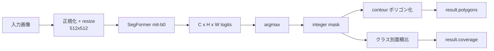

## 目的

Transformer-based なセマンティック分割モデル (SegFormer) で、
葉断面画像を以下の **6 組織クラス** に塗り分けます。

| クラスキー | 日本語 | 物理的役割 |
|---|---|---|
| `mesophyll` | 葉肉 | CO₂ 拡散の主要経路、g_m の分母 |
| `bundle_sheath` | 束鞘 | C4 CCM の濃縮室 |
| `epidermis` | 表皮 | 水蒸気バリア |
| `vein` | 維管束 | Darcy 解析の水圧源 |
| `air_space` | 気道 | f_ias の分子 |
| `stoma` | 気孔 | water path の sink / Darcy の outflow |

## モデル

Finetune 済みの `nvidia/mit-b0` ベースを使用。`models/segformer/*.bin` が
無い環境では `/analyze/segformer/status` が `{ "available": false }` を返すので、
UI が自動的にパネルを無効化します。

## データフロー



## 数式 — ピクセル分類確率

ロジット $z_{c}(x, y)$ に対する softmax が各クラス確率 $p_c$ を与えます。

$$
p_c(x, y) = \frac{\exp z_c(x,y)}{\sum_{c'} \exp z_{c'}(x,y)}
$$

ハード分割は argmax

$$
\hat c(x, y) = \operatorname*{arg\,max}_{c \in \mathcal{C}} p_c(x, y)
$$

そしてカバー率は

$$
\mathrm{coverage}_c = \frac{\lvert\{(x,y) : \hat c(x,y) = c\}\rvert}{H \cdot W}
$$

で計算します。クラス別面積比 (`coverage[tissue]`) は後段の
`f_ias` / `S_mes/S` 計算で分母 / 分子になります。

## Request / Response

```http
POST /images/{image_id}/segformer
Authorization: Bearer <supabase-jwt>
```

```jsonc
{
  "kind": "segformer_tissue",
  "result": {
    "image_shape": [1024, 1536],
    "coverage": {
      "mesophyll":     0.612,
      "bundle_sheath": 0.048,
      "epidermis":     0.125,
      "vein":          0.037,
      "air_space":     0.173,
      "stoma":         0.005
    },
    "polygons": {
      "mesophyll":     [[[x,y], ...], ...],
      "bundle_sheath": [...],
      "...":           [...]
    }
  }
}
```

## 依存関係マトリクス

| 後段パイプライン | 必須マスク | 用途 |
|---|---|---|
| water_path | `vein`, `stoma` | 水移動の source / sink |
| darcy_flow | `vein`, `stoma` | 境界条件の source / outflow |
| co2_morphometrics | 全クラス | S_mes / f_ias / 境界検出 |
| co2_diffusion | `mesophyll`, `stoma` | PDE 計算領域 |

## トラブルシューティング

> **checkpoint が見つからない** — `models/segformer/` に .safetensors / .bin を配置して
> FastAPI を再起動。起動ログに `segformer: loaded from ...` が出れば OK。

> **class imbalance** — `stoma` は画像の 1% 以下しか占めないため、
> mIoU だけで判断せず **pixel accuracy** もログを確認してください。
