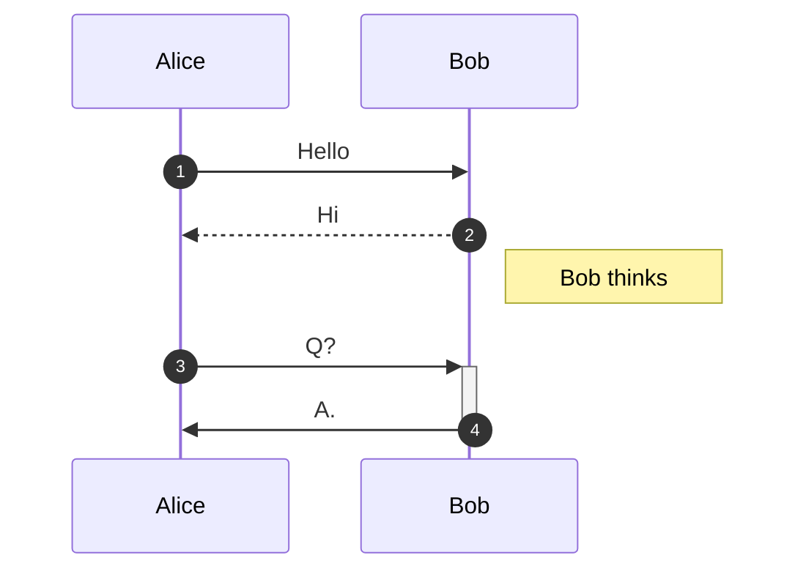
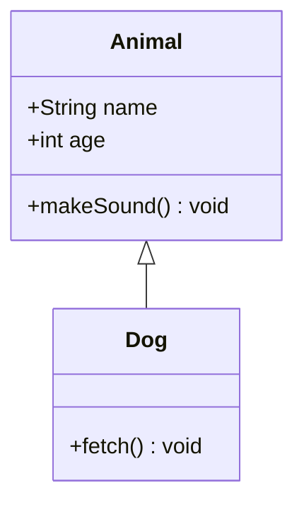
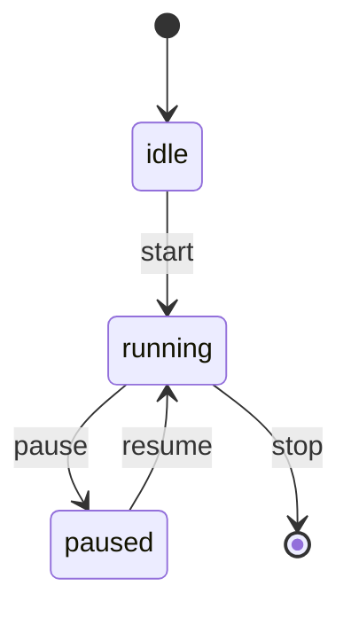
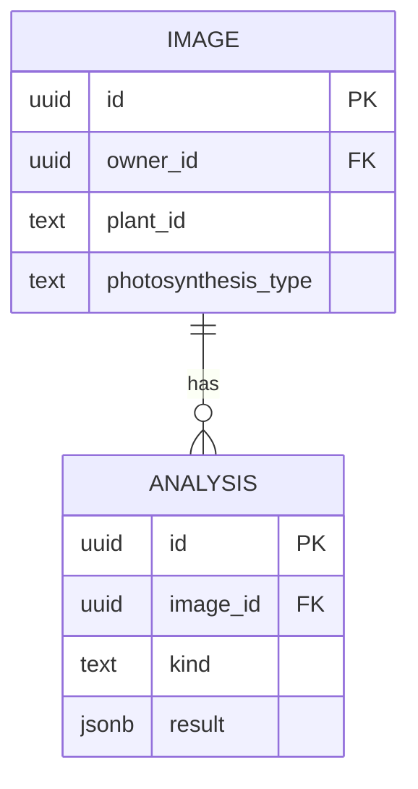
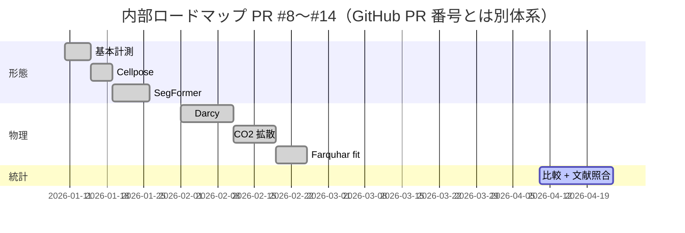
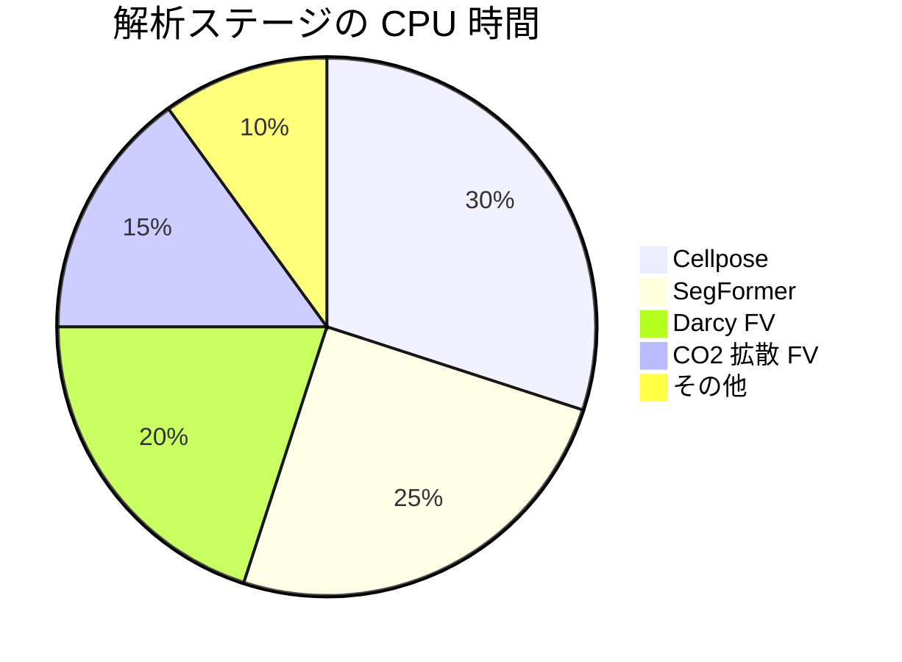
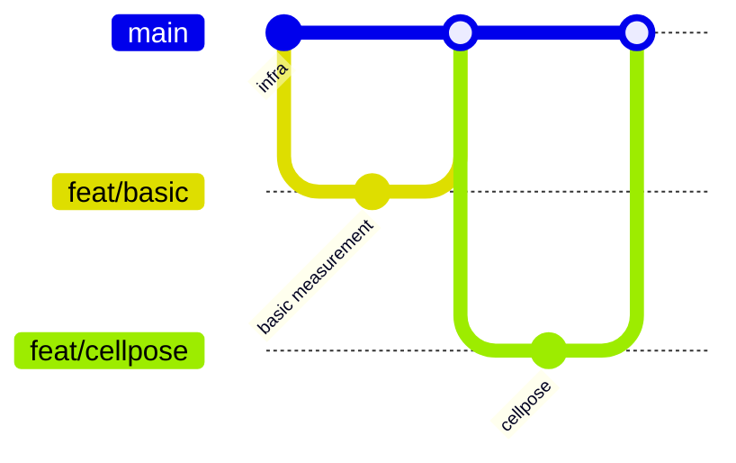
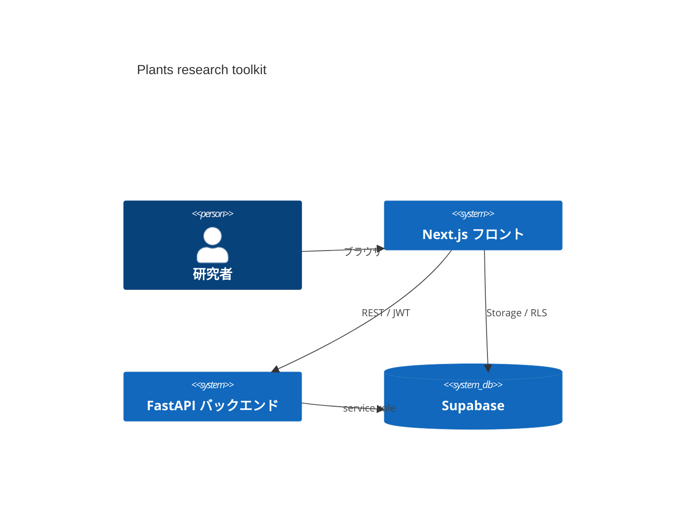

このページは **記法のショーケース** です。新しいドキュメントを追加する際の
コピー元として使ってください。

## 見出しとインライン書式

# H1（各ページで 1 本だけ）
## H2
### H3
#### H4

**太字**、*斜体*、***太字斜体***、~~打ち消し~~、`インラインコード`、
<kbd>⌘</kbd> + <kbd>K</kbd>、<mark>ハイライト</mark>、上付き H<sub>2</sub>O、
下付き X<sup>2</sup>。

## リスト

- 箇条書き
  - ネスト
    - もっとネスト
- 項目 2

1. 番号付き
2. 番号付き
   1. ネスト
3. 番号付き

### タスクリスト（GFM）

- [x] 完了したタスク
- [x] 次のタスク
- [ ] 未完了タスク
- [ ] 複数行にまたがるタスク
      （インデント揃え）

## 引用とアラート

> ただの引用。GFM の admonition は素通しで入るので、
> 強調したい場合は短い段落で区切ると読みやすい。

> **注意** — 文中リンクは [こうして外部に飛べ](https://www.katex.org/)、
> 内部リンクは [ここ](/dashboard/docs/workflow) のように書く。

## コードブロック

```python
# Python
import numpy as np

def gm_proxy(a_net: float, ci: float, cc: float) -> float:
    """g_m = A_net / (Ci − Cc)"""
    return a_net / (ci - cc)
```

```typescript
// TypeScript
export function within(v: number, lo: number, hi: number): boolean {
  return lo <= v && v <= hi;
}
```

```sql
-- SQL
SELECT image_id, MAX(created_at) AS latest
FROM analyses
WHERE kind = 'co2_diffusion' AND status = 'done'
GROUP BY image_id;
```

```bash
curl -X POST $BACKEND/compare/export -H "Authorization: Bearer $JWT"
```

## テーブル（GFM）

| 列揃え | 左寄せ | 中央 | 右寄せ |
|---|:---|:---:|---:|
| 行 1 | foo | bar | 42 |
| 行 2 | baz | qux | 3.14 |
| 行 3 | alpha | beta | 0 |

セル内にインラインコード `s_mes_s` や [リンク](/dashboard/docs) も置けます。

## 数式（KaTeX）

**インライン** — アインシュタイン表記 $a_{ij}b^{ij}$ や
Navier-Stokes $\rho(\partial_t \mathbf{v} + \mathbf{v}\cdot\nabla \mathbf{v}) = -\nabla p + \mu \nabla^2 \mathbf{v}$。

**ディスプレイ** — $$\int_{-\infty}^{\infty} e^{-x^2}\,dx = \sqrt{\pi}$$

**複数行 align** —

$$
\begin{aligned}
A_c(C_c) &= V_\text{cmax}\,\frac{C_c - \Gamma^*}{C_c + K_c(1 + O/K_o)} \\
A_j(C_c) &= \frac{J}{4}\,\frac{C_c - \Gamma^*}{C_c + 2\Gamma^*} \\
A_\text{net} &= \min(A_c, A_j) - R_d
\end{aligned}
$$

**行列** —

$$
\mathbf{M} = \begin{pmatrix}
a_{11} & a_{12} & a_{13}\\
a_{21} & a_{22} & a_{23}\\
a_{31} & a_{32} & a_{33}
\end{pmatrix}
$$

**ケース分け** —

$$
\text{sign}(x) = \begin{cases}
+1 & x > 0 \\
0  & x = 0 \\
-1 & x < 0
\end{cases}
$$

**ギリシャ文字 / 演算子 / 上下限** —

$\alpha \beta \gamma \delta \epsilon \zeta \eta \theta \iota \kappa \lambda \mu \nu \xi \pi \rho \sigma \tau \upsilon \phi \chi \psi \omega$

$\sum_{i=1}^{N}\,\prod_{j}\,\int_a^b\,\oint\,\iint\,\lim_{n\to\infty}\,\sup\,\inf$

$\mathbb{R}\,\mathbb{N}\,\mathbb{Z}\,\mathcal{O}(n\log n)\,\mathfrak{sl}_2$

$\xrightarrow{f}\,\xleftarrow{g}\,\Leftrightarrow\,\iff\,\mapsto$

**化学式** — $\ce{H2O}$ 風の mhchem は未ロード（必要なら `mhchem` プラグインを追加して
`trust: true` で許可）。現状は `H_2O` のように書くのが無難。

## Mermaid

### Flowchart

```mermaid
flowchart LR
    A[開始] --> B{条件?}
    B -->|Yes| C[処理 A]
    B -->|No|  D[処理 B]
    C --> E[終了]
    D --> E
```

### Sequence



### Class



### State



### ER



### Gantt



### Pie



### Git graph



### C4 context



## 画像と動画

### ローカル画像

画像ファイルは `frontend/public/docs-assets/` に置き、`/docs-assets/foo.png` で参照。
リポジトリにはプレースホルダー SVG だけ同梱しており、
新しい画像はオペレーターが追加してください。


### 外部画像


### 動画（拡張子で自動判定）

`` のように `.mp4` / `.webm` / `.mov` / `.ogv` / `.m4v`
で終わる URL を image syntax で書けば `<video controls>` に差し替わります。
リポジトリには動画プレースホルダーは同梱しないので、
ファイルを `frontend/public/docs-assets/` に配置してから参照してください。

```markdown

```

### YouTube 埋め込み

`<iframe>` は **`youtube.com` / `youtube-nocookie.com` / `player.vimeo.com`**
（プライベート動画も含む embed URL）のみホワイトリストされています。
これ以外のドメインの iframe はレンダリング時に `null` で破棄されるので、
`youtu.be/<id>` 短縮 URL ではなく
`https://www.youtube-nocookie.com/embed/<id>` 形式で書いてください。

<iframe src="https://www.youtube-nocookie.com/embed/aircAruvnKk" title="3Blue1Brown on neural nets" width="560" height="315" allowfullscreen></iframe>

## 脚注

本文中で参照 [^fn1] を書き、ページ末尾に定義します。

[^fn1]: これは脚注。複数行も書け、Markdown も効きます（**太字** / [リンク](/dashboard/docs)）。

## インライン HTML

`rehype-sanitize` で安全な subset のみ通します。許可されているのは
`<details>` / `<summary>` / `<kbd>` / `<mark>` / `<sub>` / `<sup>` /
`<abbr>` / `<time>` / `<u>` / `<s>` / `<del>` / `<figure>` / `<figcaption>`
等。`<script>` / `<style>` / `<link>` / `<object>` / `<embed>` / `<form>`
やイベントハンドラ属性 (`onclick=` 等) は構文上書いても除去されます。
`style="..."` 属性も値経由の XSS を防ぐため許可していないので、
色付けは Tailwind 由来のテーマカラーやアイコン文字で表現してください。

<details>
<summary>details / summary</summary>

中身はここに展開されます。このブロック内でも
**Markdown** や $\text{数式}$ は有効です。
</details>

<kbd>⌘</kbd> + <kbd>Enter</kbd>、<sup>annot</sup>、<sub>index</sub>、
<abbr title="Mean Squared Error">MSE</abbr>、<time datetime="2026-04-24">2026-04-24</time>、
<mark>highlight</mark>。

## 区切り線

---

## 編集方法

新しいドキュメントを追加するには

1. `frontend/content/docs/<category>/<slug>.md` を作る
2. 上部に front-matter を入れる
   ```yaml
   ---
   title: 表示タイトル
   description: 1 行概要（サイドバー + <header>）
   category: pipelines   # 省略時はトップレベルに並ぶ
   order: 30             # 同カテゴリ内の並び順
   ---
   ```
3. `/dashboard/docs` を再読み込みすればサイドバーに自動で並ぶ
4. 画像 / 動画は `frontend/public/docs-assets/` に配置して `/docs-assets/<file>` で参照
