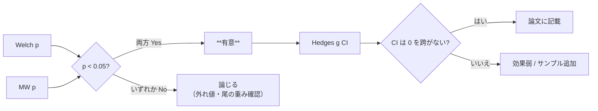

## 目的

指標 $x$ について、グループ A（例: C3）と B（例: C4）の分布が有意に
異なるかを、**パラメトリック + ノンパラ + 効果量** の 3 視点で検定します。

## 使う統計量

### Welch の $t$ 検定

等分散を仮定せず平均差を検定。

$$
t = \frac{\bar x_A - \bar x_B}
{\sqrt{\dfrac{s_A^2}{n_A} + \dfrac{s_B^2}{n_B}}}
$$

自由度は Welch-Satterthwaite

$$
\nu = \frac{\left(\dfrac{s_A^2}{n_A} + \dfrac{s_B^2}{n_B}\right)^2}
{\dfrac{(s_A^2 / n_A)^2}{n_A - 1} + \dfrac{(s_B^2 / n_B)^2}{n_B - 1}}.
$$

### Mann-Whitney $U$

分布仮定を置かないランク和検定。

$$
U_A = \sum_{i=1}^{n_A}\sum_{j=1}^{n_B} \mathbb{1}[x_i^{(A)} > x_j^{(B)}]
$$

### Cohen $d$ / Hedges $g$

$$
d = \frac{\bar x_A - \bar x_B}{s_p},\quad
s_p = \sqrt{\frac{(n_A - 1)s_A^2 + (n_B - 1)s_B^2}{n_A + n_B - 2}}
$$

小標本バイアス補正 Hedges

$$
g = d \cdot \left(1 - \frac{3}{4(n_A + n_B) - 9}\right)
$$

### Bootstrap 95% CI

ペア $\bigl(\{x_i^{(A)}\}, \{x_j^{(B)}\}\bigr)$ を **B 回リサンプル** し、
それぞれで $g^*$ を計算。2.5% / 97.5% パーセンタイルを CI とします。

$$
\mathrm{CI}_g = \bigl[\, g^*_{(0.025\,B)},\, g^*_{(0.975\,B)}\,\bigr]
$$

実装では $B = 2000$ がデフォルトで、UI から `bootstrap_iters` を指定可能。
計算量は $O(B \cdot (n_A + n_B))$ で、$n \lesssim 200$ 程度なら
数百 ms で完了。

## 有意判定ヘルパー



## リクエスト例

```http
POST /compare
Authorization: Bearer <supabase-jwt>
Content-Type: application/json

{
  "group_a": { "photosynthesis_type": "C3" },
  "group_b": { "photosynthesis_type": "C4" },
  "metrics": ["co2_s_mes_s", "co2_f_ias", "darcy_k_leaf"],
  "bootstrap_iters": 2000
}
```

### レスポンス（抜粋）

```jsonc
{
  "metrics": [
    {
      "metric": { "key": "co2_s_mes_s", "label": "S_mes/S", "unit": "-" },
      "group_a": { "n": 12, "mean": 14.8, "median": 15.0, "sd": 2.1,
                   "q25": 13.5, "q75": 16.5, "min": 10.0, "max": 20.0,
                   "image_ids": [...], "values": [...] },
      "group_b": { "n":  9, "mean":  5.2, "median":  5.0, "sd": 1.3,
                   "q25": 4.0, "q75": 6.0, "min": 3.0, "max": 7.5,
                   "image_ids": [...], "values": [...] },
      "tests":   { "welch_t_statistic": 8.2, "welch_p_value": 1.5e-6,
                   "mann_whitney_u": 4.0, "mann_whitney_p_value": 2.3e-5 },
      "effect_size": { "cohens_d": 5.1, "hedges_g": 4.95,
                       "hedges_g_ci_low": 3.2, "hedges_g_ci_high": 6.7 }
    }
    // ...
  ]
}
```

> トップレベルキーは **`metrics`** (リクエストの `metrics` リストと同名)。
> 古いコメントで `metric_rows` と書かれている場合は誤記なので注意。

## ダッシュボード UI

- 箱ひげ + ジッタープロット（per-metric）
- カラーコード済み significance マーカー
- CSV ダウンロード + **Markdown / CSV エクスポート** (`POST /compare/export`)

## サンプルサイズの目安

| 想定効果量 $g$ | 両群合計 $n$ | Welch p < 0.05 検出力 |
|---|---|---|
| 0.5 (小) | 128 | ≈ 0.8 |
| 0.8 (中) |  50 | ≈ 0.8 |
| 1.5 (大) |  16 | ≈ 0.8 |

> **片寄ったコホート** — 画像ベースの S_mes/S は C3 / C4 の差が $g > 3$
> になることが多く、各群 **5 枚** でも検出力は十分。ただし
> 文献レンジとの整合性を論じるには **10 枚以上** を推奨。
