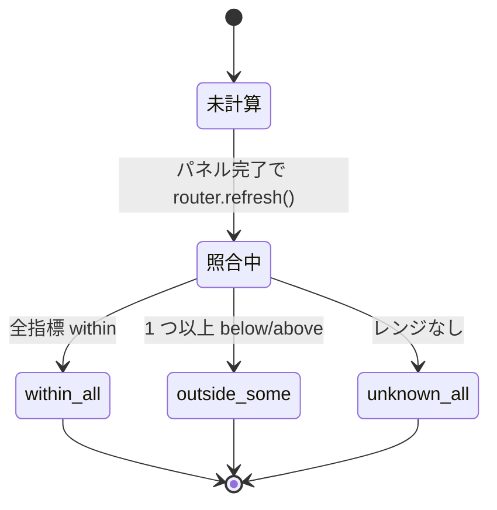

## 背景

形態 2D プロキシや PDE ベースの指標は、**絶対値が文献値と整合しているか**
を毎回確認する必要があります。このチェックを UI 上で自動化したのが
文献照合フェーズです。

## 判定ロジック

指標 $k$、光合成タイプ $\tau$、測定値 $v$ に対し、
`literature_ranges.py` から最適レンジを引きます。

$$
\text{status}(k,\tau,v) \;=\;
\begin{cases}
\text{within} & r_\text{min}(k,\tau) \le v \le r_\text{max}(k,\tau)\\
\text{below}  & v < r_\text{min}(k,\tau)\\
\text{above}  & v > r_\text{max}(k,\tau)\\
\text{unknown} & \text{該当レンジなし}
\end{cases}
$$

$\tau$ マッチング順序 (`pipeline/literature_ranges.py::find_range`):

1. 完全一致 (`C3` / `C4` / `C3-C4` / `CAM`) のレンジを優先
2. なければ pooled `any` のレンジにフォールバック
3. それも無ければ `None` を返却 → 呼び出し元 (`api/validation.py`) で
   `status = "unknown"` として finding に載る

`photosynthesis_type == "unknown"` (PR #8 の enum 値) は
`api/validation.py` 側で `None` に変換してから渡しているので、
上記 1 のステップは無マッチで通り抜けて 2 → 3 のフォールバックに
落ちる挙動になっています。

## 文献ソース（抜粋）

| 指標 | 対象 | レンジ | 出典 |
|---|---|---|---|
| $S_\text{mes}/S$ | C3 | 8.0 – 22.0 | Tosens *et al.* 2012 |
| $S_\text{mes}/S$ | C4 | 3.0 – 8.0 | Tomás *et al.* 2013 |
| $f_\text{ias}$ | C3 | 0.15 – 0.45 | Terashima *et al.* 2011 |
| $f_\text{ias}$ | C4 | 0.05 – 0.20 | Dengler & Nelson 1999 |
| $T_\text{cw}$ | C3 | 0.1 – 0.5 µm | Evans *et al.* 2009 |
| $T_\text{cw}$ | C4 | 0.15 – 0.6 µm | Evans *et al.* 2009 |
| $g_m$ | C3 | 0.05 – 0.60 | Flexas *et al.* 2008 |
| $g_m$ | C4 | 0.03 – 0.40 | Flexas *et al.* 2008 |
| $V_\text{cmax}$ | C3 | 30 – 200 µmol m⁻² s⁻¹ | Wullschleger 1993 |
| $V_\text{cmax}$ | C4 | 20 – 100 µmol m⁻² s⁻¹ | Wullschleger 1993 |
| $J_\text{max}$ | C3 | 60 – 300 µmol m⁻² s⁻¹ | Wullschleger 1993 |
| $R_d$ | any | 0.2 – 3.0 µmol m⁻² s⁻¹ | Atkin *et al.* 2005 |
| $C_c$ 平均 | C3 | 5 – 25 Pa | Flexas *et al.* 2008 |
| $C_c$ 平均 | C4 | 20 – 150 Pa | von Caemmerer 2000 |

完全な表は `/literature/ranges` で取得、あるいは
[文献ページ](/dashboard/literature) で検索できます。

## UI — ValidationBadge

画像詳細ページの右上に表示されるバッジで、状態が色分けされます。

- 🟢 **within** — 全指標が範囲内
- 🟡 **outside** — いずれかが下/上
- ⚪ **unknown** — 範囲なし or 未計算

クリックで findings リストが展開し、
`measured → status` と出典を 1 行で表示。



## なぜ「within = 正解」ではないか

> **注意**: 文献レンジは *well-watered, ambient CO₂, 25 °C* の健康な個体の
> 値です。ストレス実験（水ストレス、高 CO₂、低光量など）では
> 系統的にレンジ外になるのが **期待される** ことが多いので、
> within = 健常、outside = 処理による差、と解釈してください。

## pooled (`any`) vs C3/C4 split

$C_c$ / $C_c$ drawdown のように C3 / C4 で生物学的に大きく違う指標は、
プールしてしまうと違いをマスクするため **C3 専用 / C4 専用** の
別レンジを登録しています（PR #17 round-1）。

```python
# 例: co2_cc_mean_pa
LITERATURE_RANGES = (
    ...,
    LiteratureRange(parameter_key="co2_cc_mean_pa", applies_to="C3",
                     min=5.0, typical=18.0, max=25.0, unit="Pa",
                     source="Flexas et al. 2008"),
    LiteratureRange(parameter_key="co2_cc_mean_pa", applies_to="C4",
                     min=20.0, typical=60.0, max=150.0, unit="Pa",
                     source="von Caemmerer 2000; Ghannoum 2009"),
)
```

逆に、由来がモデル内部に強く依存する $K_\text{leaf}$ は pooled `any`
として登録し、絶対値より **群間比** を見ろとコメントしています。
