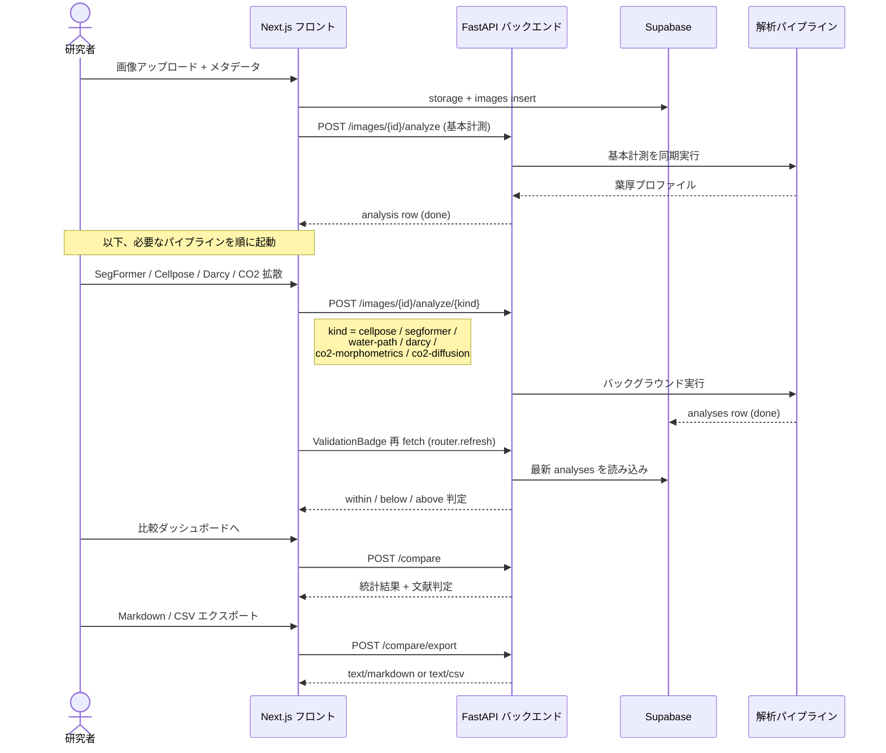

## 典型的な 1 セッション

新しい C3 / C4 比較を始めるときの流れを順序図に示します。

## チェックリスト

操作手順をまず押さえたい場合は下記を順にクリアしてください
（GFM のタスクリストがそのまま動きます）。

- [x] プロジェクト Supabase に招待済み
- [x] `images` バケットにアップロード権限がある
- [ ] LI-COR XLSX / CSV を取得し `/dashboard/gas-exchange` で取り込み
- [ ] SegFormer の checkpoint が `/analyze/segformer/status` で `available: true` を返す
- [ ] Cellpose モデルキャッシュが `models/` 配下に降ってきている
- [ ] 比較したい C3 / C4 の **画像枚数 ≥ 5** ずつ揃っている
- [ ] `plant_id` / `treatment` / `photosynthesis_type` がメタデータに入力済み

## 役立つショートカット

<kbd>⌘</kbd> / <kbd>Ctrl</kbd> + <kbd>K</kbd> で画像検索を開けるようにしたい場合は、
将来的に `frontend/components/CommandPalette.tsx` を追加してください（未実装）。

## 推奨される撮影条件

クリックで展開

- 照度均一の透過光、倍率 40×
- スケールバー **200 µm** 以上を必ず写し込む
- 葉組織が画面の 60% 以上を占めるようクロップ
- JPEG 品質は 90 以上、WebP 可

